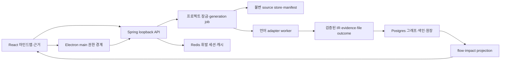

# 구조·공통 IR·데이터 계약 v1

## 1. 유지할 구성과 대안 비용



[현재 SPI](../../backend/src/main/java/dev/codeintelligence/analysis/core/CodeAnalyzer.java), AnalysisResult/GraphNodeDraft/GraphEdgeDraft/AnalyzerEvidence, graph persistence와 Flyway를 확장한다. Java parsing은 동일 Java 라이브러리를 **별도 worker JVM**으로 옮겨 강제 취소/OOM을 backend 수명과 분리한다. 이 부분은 기능 재작성보다 프로세스 경계 추가이며 기존 golden 동일성·시작시간 비용을 T03에서 측정한다. TS sidecar는 기존 소스와 ts-morph를 유지한다. tree sidecar는 R2부터 패키지/registry에 정식 포함한다.

| 대안 | 이익 | 호환/이행 비용과 결정 |
|---|---|---|
| 현재 relational graph+JSONB 유지 | 소유권·snapshot·노트·backup transaction 재사용 | service namespace·generation·evidence migration 필요. **선택** |
| Neo4j 등 새 graph DB | 일부 traversal 표현 간단 | 추가 runtime/패키지/이중저장·backup·기존 SQL/API 전환, 현재 성능 병목 증거 없음. 제외 |
| SQLite/단일 native backend로 전환 | 설치 크기·프로세스 축소 가능 | JPA/Flyway/pgvector/검색/backup/동시성 재검증, 기능·데이터 손실 위험. 제외 |
| 모든 언어 tree-sitter만 | grammar 통일 | 의미 해석을 잃고 기존 Java/TS 정확도 하락. P/S fallback으로만 사용 |
| 모든 LSP 자동 실행 | IDE 분석 재사용 | user code/build hooks/toolchain/SDK 실행 및 버전 통제 비용. 제외 |
| AI가 그래프 작성 | 빠른 외형 확장 | 재현성·비밀·가격·거짓 근거 문제. AI는 해석 계층으로만 유지 |

Redis는 휘발 캐시/세션으로 유지한다. 예산 잠금·job fencing·snapshot commit은 Postgres가 담당하되, 복원으로 되돌아가면 안 되는 전송 의무·업데이트 최소버전·키 high-water는 05 §7의 별도 safety journal을 따른다. 불일치 시 비용 기능은 OFF다. Redis 제거 최적화는 프로파일 후 별도 ADR 대상이다.

### ADR-01: 분석 worker의 macOS 권한 경계

선택은 **서명된 native XPC supervisor 서비스의 App Sandbox**다. Electron renderer sandbox/단순 JVM 분리와 다른 OS 경계다. Electron main의 작은 native bridge가 XPC를 사용하고, Spring은 main과 설치 전용 0600 Unix-domain control socket+실행별 capability로 작업을 주고받는다. 공개 loopback API/renderer에는 supervisor capability를 제공하지 않는다. XPC 연결은 audit token의 서명된 caller identity/TeamID/bundleID를 검증하고 runId/epoch/nonce를 묶는다.

XPC supervisor에는 app-sandbox만 필수, network.client/server·user-selected files·home/Downloads 접근·Keychain access group·automation entitlement를 부여하지 않는다. 입력은 main이 복호화·hash 검증한 **승인 manifest의 bytes**를 bounded IPC로 전달한다. absolute path/원본 폴더 권한/비밀/key/token/DB credential을 전달하지 않는다. worker scratch는 supervisor의 전용 container 아래 run별 디렉터리이며 job 종료·시작 시 정리한다. 시스템 라이브러리/자체 bundle/container에 대한 OS 허용 범위는 source 외 사용자 자료 접근과 구별한다.

supervisor가 launch할 수 있는 worker는 패키지 manifest의 고정 경로+서명+hash가 일치하는 Java/Node/추후 parser뿐이다. child는 app-sandbox+inherit로 supervisor 제한을 상속하며 repo 설정이 경로·argv·env를 결정하지 못한다. production adapter transport는 **길이-prefix bounded stdio**, main↔supervisor는 XPC다. 현재 TS/tree HTTP server는 개발 harness에 남기고 extraction engine은 변경하지 않는다. 03 §6 session 명령은 이 transport 위에서 작동한다. repository config/plugin을 import/eval하는 loader는 두지 않는다.

App Sandbox가 모든 자식 실행을 금지한다고 주장하지 않는다. 고정 launcher·hook/plugin 미실행은 제품 계약, 자손의 사용자 파일/네트워크 권한 제한은 OS 계약이다. 시험에서는 의도적으로 spawn한 probe 자손도 원본 밖 파일/키 저장소·TCP/UDP/DNS 접근을 거부당해야 한다. inherited child가 sandbox 없이 실행될 가능성이 있으면 adapter 활성화를 차단한다. parser code execution 취약점의 피해도 sandbox 범위 안으로 제한하려는 설계이며 OS 계정 전체 침해에 대한 보장은 아니다.

기동 시 supervisor attestation(서명/entitlement/manifest/nonce) 실패, helper 미서명, sandbox 초기화 실패, transport protocol mismatch는 **ADAPTER_ISOLATION_UNAVAILABLE**. 일반 child/HTTP 방식으로 production fallback하지 않는다. 미서명 dev 분석은 합성 fixture 전용 TEST_ONLY 모드이며 사용자 repo UI에서 켤 수 없다.

[Apple entitlement 문서](https://developer.apple.com/library/archive/documentation/Miscellaneous/Reference/EntitlementKeyReference/Chapters/EnablingAppSandbox.html)는 XPC 권한 분리와 child 상속을 구분한다. 정확한 entitlement/JRE·Node native loader 호환은 T03 첫 기술 검증 gate다. 선택은 이미 XPC로 정했으며 실패하면 R1을 중단하고 좁은 ADR 재검토, 신뢰 경계를 완화하지 않는다. Electron/Spring/분석 엔진/DB를 교체하지 않는 transport·권한 경계 변경이다.

## 2. 공통 식별·근거 계약

모든 v1 계약은 JSON Schema로 구현하고 `contractVersion`, `producerVersion`, `rulesHash`를 필수로 둔다. 추가 optional 필드는 호환, 의미가 바뀌면 major 증가. 모르는 major/capability는 추측해 읽지 않고 `CONTRACT_UNSUPPORTED` 반환한다.

| 레코드 | 필수 필드/불변식 |
|---|---|
| SnapshotManifest | projectId, snapshotId, sourceKind, commitOid(nullable), dirty flag, ordered entries(path, blobSha256, byteSize, language candidates), exclusionPolicyHash, manifestDigest, createdAt. Git SHA와 실제 copied bytes hash는 별개 |
| AnalysisGeneration | generationId(UUID), snapshotId, contractVersion, adapterManifestHash, rulesHash, configHash, dependencyContextHash, status, previousCommittedGenerationId, fencingEpoch. 같은 snapshot도 분석 버전에 따라 별 generation |
| AdapterDescriptor | adapterId/version/binaryDigest, languageVersions, frameworkVersions, capability set(P/S/C/F/X 등), ownedCapabilities, requiredContext, limit policy, native OS/arch, license/SBOM |
| Module/Service | project-local moduleId와 serviceId, source roots/config spans, deploymentProfile(optional). 이름만 같은 모듈을 합치지 않음. 경계 미확정이면 UNKNOWN namespace로 격리 |
| Node | nodeId, generationId, semanticKey, kind, language, moduleId/serviceId, qualifiedName/signature, primarySpan, provenanceIds. nodeId=hash(generationId, semanticKey). semanticKey=language+module+qualifiedName+signature; local/anonymous는 enclosing key+span anchor |
| Edge | edgeId, generationId, sourceId, targetId 또는 targetCandidates, relationKind, resolutionState, evidenceIds, ruleId, contextAssumptions, blockers, scoreVersion. 아래 factKey로 idempotent 저장. 미해결 호출을 억지 target node로 만들지 않음 |
| Evidence | evidenceId, subjectType(NODE/EDGE/CLAIM), subjectId, role(callsite/declaration/config/contract), snapshotId, blobSha256, relativePath, byteStart/byteEnd, line/column, extractor/version/ruleId, excerptDigest; 암호화 원본 span을 기준으로 마스킹 excerpt 생성 |
| FileOutcome | generationId, path, adapterId, capability, eligibility, status, bytesRead, duration, diagnosticsCode, attemptedContext. unique(generation,file,capability,owner). success와 부분/실패/미지원/제외/취소 구분 |

범위는 원본 bytes의 `[start,end)` UTF-8 offset, 행/열은 1부터의 Unicode scalar 좌표다. CRLF/비ASCII/BOM의 byte→display map을 저장/테스트하며 변환 후 텍스트 offset을 원본으로 오인하지 않는다. Vue/Svelte script slice는 source map을 필수로 반환한다. invalid UTF-8는 BINARY_OR_ENCODING_UNSUPPORTED 처리; 정적 evidence 없는 generated node는 파생 노드라고 표시하고 원인 span 목록을 요구한다.

Endpoint identity = serviceId + profile + protocol + method + normalizedPath + routeConditions(headers/consumes/produces/version) + handler identity. Table = datasourceNamespace + schema + table; topic = brokerNamespace + topic. 미확인 namespace를 다른 서비스와 전역 dedup하지 않는다. 현재 api_endpoints의 `(snapshot,method,path)` unique를 서비스/조건을 포함한 제약으로 이행한다.

**Edge identity:** `callsiteKey=hash(moduleId,blobHash,byteStart,byteEnd,AST-role)`; 구조 관계는 `originKey=hash(정렬된 원인 evidence IDs,관계 role)`을 사용한다. `factKey=hash(sourceSemanticKey,relationKind,callsiteKey 또는 originKey,정렬된 targetSemanticKey 집합,ruleId,ownerAdapterId)`; `edgeId=hash(generationId,factKey)`. 같은 줄의 `f(); f();`는 byte span이 달라 별 edge, 같은 result page 재전송은 같은 factKey라 중복되지 않는다. 서로 다른 callsite를 source/target/type만으로 합치지 않는다. UI 집계 edge는 별 projection으로 fact ID 목록/횟수를 가진다.

M1/M4에서 현재 `uq_graph_edges_ends_type`을 `(generation_id,fact_key)`로 대체하고 source/target/type은 비고유 조회 index로 유지한다. 후보 집합 변경은 새 fact이며 staging generation의 이전 후보 fact를 tombstone 처리한 뒤 current 전환한다. rule/owner 중복은 registry 오류로 reject하고 서로 다른 독립 근거는 fact evidence 목록에 추가한다. legacy edge는 callsite를 복원할 수 없으면 LEGACY_AGGREGATE이며 재분석 전 개별 호출 metric에 넣지 않는다.

읽기 API 목표: `GET /api/projects/{p}/snapshots/{s}/generations/{g}/graph?cursor=…&limit=500`, `/evidence/{e}`, `/coverage`, `/impact?node=…&maxDepth=8&confidence=…`. owner·snapshot·generation 매칭을 서버에서 검사하며 cursor에도 g/filter hash를 결합한다. generation 변경 시 cursor 재사용은 409. evidence bytes hash 불일치는 409 `EVIDENCE_STALE`, 없으면 410 `SOURCE_RETIRED`; 현재 working tree로 대체하지 않는다.

```json
{
  "contractVersion": 1,
  "relationKind": "HTTP_CONSUMES",
  "resolutionState": "INFERRED",
  "sourceSemanticKey": "ts|web|OrdersPage/load",
  "targetCandidates": ["http|orders|GET|/orders/{id}", "http|admin|GET|/orders/{id}"],
  "evidenceRoles": ["callsite", "route-declaration"],
  "blockers": ["SERVICE_ORIGIN_UNRESOLVED"],
  "ruleId": "http-path-candidate-v1",
  "scoreVersion": "evidence-v1",
  "qualityScore": 50,
  "calibratedProbability": null
}
```

이는 읽기 쉬운 예시 projection이다. 실제 persisted edge에는 위 표의 IDs/hash/양쪽 span을 모두 요구한다. 후보 2개를 임의 정렬해 하나의 확정 edge로 고르지 않는다.

## 3. 증거 강도·coverage·충돌

`STATIC_RESOLVED`는 **명시된 정적 문맥에서 대상 식별을 해결함**이다. 런타임 실행 보장은 아니다. `INFERRED`는 후보 연결, `UNRESOLVED`는 처리했으나 target 불명, `UNSUPPORTED`는 capability 없음, `FAILED`는 처리 실패다. 사용자 수동 판단은 별도 `USER_ASSERTED` annotation으로 보존하며 parser fact를 덮지 않는다.

재현 가능한 evidence-v1 quality score(정확 확률 아님):

`q = clamp(0,100, 25*S + 25*T + 20*C + 20*R + 10*U - 25*K)`.

S=검증된 call/source span, T=검증된 target declaration/contract span, C=필요 config·dependency 문맥 완비, R=version-gated static resolver 성공, U=유일 후보, K=동일 문맥의 상충 증거 존재; 각 0/1. q=100, K=0, blocker=0, rule gate 통과일 때만 STATIC_RESOLVED 가능. API 문자열/ORM 이름 일치 rule은 R=0이며 q와 무관하게 INFERRED 상한; 미해결 service/profile은 C=0. K=1이면 unresolved로 강등하고 양쪽 근거 공개. 구문 오류 영역을 통과하는 span은 S/T를 0으로 처리한다.

기본 UI에는 등급/이유를 보여주고 q는 고급 진단에 “증거 충족 점수”로만 표시한다. `80% 정확`처럼 변환 금지. 보정 확률은 향후 같은 언어·rule·버전의 고정 holdout ≥200 예측을 대상으로 reliability bin 표와 Wilson 95% 구간·sample n을 함께 제공할 때만 활성화한다. 현재 계획의 공개 UI에는 확률 없음.

경로는 모든 edge의 최저 등급을 상속한다. q 표시가 필요하면 min(edge q); 곱셈/평균으로 “전체 실행 확률”을 만들지 않는다. 한 추정 구간이 있으면 전체 흐름이 추정이다.

Coverage 불변식:

- discovered = excluded + eligible (raw manifest 기준; 접근 불가 항목은 별도 count).
- capability별 eligible = success + partial + failed + unsupported + cancelled + pending. 이 분할은 상호 배타적이며 파일/capability owner별 한 번만 센다.
- parsed ratio = P.success/P.eligible, symbol extraction ratio = S.success/S.eligible, call resolution ratio = resolved callsites/attempted callsites. 두 비율을 단일 “분석률”로 합치지 않는다.
- 미지원까지 포함한 전체 분모와 capability 대상 분모를 함께 표시. 0/0은 N/A. failed parser 100개를 eligible에서 빼서 100% 만들기 금지. bytes 기준도 병기.
- TS/tree 중복 시 registry가 owner 지정. R2 Python/Go P/S는 tree가 owner, regex는 shadow 비교만 하며 두 결과를 합산하지 않는다. framework adapter는 같은 node에 근거를 추가할 수 있으나 source claim 소유권은 하나다.
- 과거 generation에 outcome이 없으면 `LEGACY_UNMEASURED`. 현재 설정의 analyzer ON/OFF로 과거 분석 상태를 재계산하지 않는다.

## 4. 소스 저장·보존과 migration

현재 FileService는 snapshot metadata와 현재 clonePath를 섞을 수 있으며 현재 GraphPersistenceService는 node loop에만 evidence를 저장한다. **소스 snapshot 저장과 EDGE evidence 독립 저장을 먼저 구현**한다. 단순 hash column 추가로 해결됐다고 하지 않는다.

선택: 설치 전용 source store에 content-addressed blob 저장, blob별 무작위 nonce AEAD 암호화. key는 safeStorage로 감싼 설치 keyring, 상대 경로/메타는 소유자 권한 DB. hash는 plaintext bytes의 SHA-256이고 filesystem 위치에는 project namespace를 포함한다. user root path는 source store key가 아니다. 분석 worker에는 해당 generation의 제외 완료 텍스트만 임시 0700 workspace로 제공하고 종료/시작 시 잔여 임시자료 정리. 정상 로컬 DB·메타 전체의 암호화는 별도 보장하지 않으므로 OS 계정/디스크 암호화 경계 명시.

ingest: safe preview→copy stream의 hash 재검증→blob fsync→manifest staging→DB transaction에서 snapshot commit. 실패하면 마지막 committed pointer를 유지한다. root가 바뀌거나 파일이 race로 변경되면 승인 digest 불일치로 새 preview를 요구한다. snapshot에는 포함된 bytes만 있고 excluded secret을 복원하기 위해 숨겨 복사하지 않는다.

retention: 기본 최근 5 snapshots/project + note/task가 참조한 snapshot pin + 사용자가 pin한 것 유지, 자동 삭제 전 30일 유예. storage 기본 quota 10GiB/설치이며 넘으면 가져오기/분석 전에 정리 선택을 요구한다. pin/current/recovery backup 참조 blob은 GC 금지. GC는 manifest mark→유예 tombstone→락 안에서 재검증→삭제, crash 후 재개 idempotent. 삭제 확인창은 원본 영향 없음·사라질 근거/노트 참조 수 표시. 키 분실이면 암호화 source를 복구할 수 없고 새로 가져오도록 안내한다.

Migration은 기존 V1–V21 파일을 수정하지 않는 새 순번:

1. M1 additive: generation/outcome/source_blob/manifest/edge_evidence/service namespace 및 v1 contract 필드. 기존 rows는 LEGACY_UNMEASURED/LEGACY_SOURCE_UNVERIFIED.
2. M2 재분석: 현재 source가 기록 hash와 일치할 때만 legacy current snapshot을 materialize. 이전 bytes가 없으면 unavailable 유지. 새 snapshot/generation으로 재분석하고 노트/task의 옛 참조는 지우지 않음.
3. M3 shadow: 기존 Java/TS 추출을 v1 translator로 읽되 출처/문맥 불명은 resolved로 승격하지 않음. 새 결과와 old projection 차이를 oracle로 설명.
4. M4 cutover: API version/feature flag로 v1 read 전환. old endpoint unique/index 및 evidence 링크를 새 구조로 backfill 후 검증. 충돌 rows는 합치지 않고 reanalysis-required.
5. M5 cleanup: 최소 2개 정상 릴리스 후 오래된 읽기 경로 제거. 노트/task identifier translation은 explicit map으로 제공, 자동 이름 추정 연결 금지.

rollback은 새 schema를 옛 binary로 그대로 열기보다 migration 전 checkpoint의 DB+source store를 **같이** 복원한다. 05 §7의 identity·key vault·safety journal·antirollback high-water는 복원 대상 밖에 남고, 필요한 old source key를 추가로 참조할 뿐 최신 vault를 과거 버전으로 교체하지 않는다. 호환성 manifest에 supportedSchemaMin/Max를 넣고 맞지 않으면 read/write 시작 차단. rollback 과정에서 더 최신 데이터 손실 가능성을 표시하며 먼저 별도 recovery copy 보존.

## 5. Flow와 변경 영향의 의미

Flow는 정적 연결의 경로이지 실행 trace가 아니다. typed edges에 실행·구조 의미를 구분한다: CALLS/HTTP_CONSUMES/PUBLISHES는 흐름 후보, CONTAINS/IMPORTS/DECLARES는 구조이며 자동 실행 단계로 섞지 않는다. 재귀/SCC는 묶음으로 접고 이유·깊이 제한을 보인다.

Impact는 **변경 후보 집합**이다. confirmed tier는 STATIC_RESOLVED CALLS/IMPORTS/REFERENCES/HTTP_CONSUMES의 역방향 traversal, inferred tier는 추정 edge를 한 번이라도 통과한 후보다. CONTAINS/MAPS_TO 같은 구조 관계는 선택한 impact rule이 의미를 정의했을 때만 포함. visited=(node,tier)로 cycle·다중 경로 중복 제거, 최단 설명 경로와 추가 경로 수를 보존. 기본 depth8/max10,000 visited, UI 처음500, 초과는 TRUNCATED. `0 confirmed / 4 inferred / unsupported 20 files`를 보여 주며 “안전한 변경”을 결론 내리지 않는다. 변경된 exported API/route/schema는 해당 contract 의존 모듈 재분석을 요구한다.

## 6. 증분·session·취소

R0/R1의 첫 구현은 full immutable snapshot과 bounded whole-project TS 분석 유지(현재 10MiB JSON/20,000 입력 파일). 한계 초과는 IMPORT 실패와 ANALYSIS_LIMIT를 구분해 명시. 조용한 500파일 재분할은 금지다. T05 session protocol이 통과하기 전 10MiB를 늘리지 않는다.

목표 session 계약: `open(manifestDigest,limits,adapterVersion,fencingEpoch)`→`put(chunk<=1MiB,seq,hash)`→`seal(exact manifest)`→`analyze`→`result pages`→`close`. chunk는 전송 단위이고 compiler project는 전체 manifest의 단일 문맥. missing/duplicate/hash mismatch는 seal 실패. 세션 inactivity 60초, job hard timeout 적용; TTL 후 파일/worker 정리. production session은 ADR-01의 XPC/stdio에서 run token·epoch·no source-path escape 검사를 적용한다. loopback HTTP는 합성 fixture 개발 harness에만 남긴다.

증분 key = blobHash+adapter binary/version+grammar+rule+contract+config+module boundary+dependency closure digest. 파일 변경은 import/call/export/config 역의존을 invalidation; tsconfig/pom/build metadata/routes 변경은 관련 project 전체; resolver dependency 불완전이면 full fallback. 증분 결과와 clean full 결과 canonical graph/evidence/outcome이 동일해야 한다. cache 손상/버전 불일치는 재계산, facts로 사용하지 않는다. AI context/embedding cache는 provider/model/redactionPolicy/sourceHash를 추가한다.

프로젝트당 writer 1, 동시에 분석 project 1(기본), adapter workers 최대2. DB active unique+row lock 유지, generation fencingEpoch로 late worker write 거부. 취소→CANCELLING→cooperative stop 5초→worker kill 및 wait 10초 내→staging 폐기→CANCELLED. lock은 writer 종료+cleanup 확인 뒤만 해제. backend 자체의 import/copy도 1MiB checkpoint와 interruptible IO timeout 적용. 실패/취소 partial generation은 명시적 inspection 전용이며 current pointer를 바꾸지 않는다. retry는 새 epoch/run, old generation 재개는 input/adapter hash가 전부 같고 검증된 checkpoint일 때만 가능하다.
